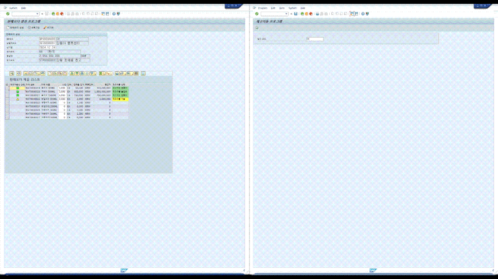

<br>

<div style="border: 2px solid #F77623; border-radius: 8px; overflow-x: auto;" align=center>


|                       이름(담당 모듈)                        | ABPA 프로그램                                                |
| :----------------------------------------------------------: | :----------------------------------------------------------- |
| **윤소영(SCM)<br><br>[](https://github.com/usern77)** | **⚬ [SD] 판매운영계획 생성 및 조회**<br>**⚬ [MM] 재고 이동**<br>⚬ [SD] 배송문서 생성 프로그램<br/>⚬ [MM] 폐기 처리 배치 프로그램<br/>⚬ [SD] BP 마스터 프로그램<br/>⚬ [SD] 납품처 엑셀 업로드 프로그램<br/>⚬ [SD] 완제품 판매가 마스터 프로그램<br/> |

</div>
<br>


# [MM] 재고 이동 프로그램



**조회** 창고코드 값 입력 후 ‘실행’버튼 클릭 시, 화면 전환 후 창고별 수량 창에 입력한 창고코드가 메인창고에 표시되고 그 외 완제품 수량창고들 (서브창고)가 표시된다. 재고현황 리스트 ALV에는 완제품 관련 재고수량이 표시된다 자재번호 입력 후 엔터를 누르면 창고별 제품 재고 수량이 표시된다

**이동 조건** 재고이동 조건에 입고창고, 출고창고, 이동하고 싶은 수량 입력 후 재고이동 버튼을 누르면 재고이동을 하겠냐는 컨펌 팝업창이 뜬다.

**확인 버튼** YES 버튼을 누르면 재고현황 리스트 ALV에 입고 창고인 경우 Green 으로 합산된 재고 수량이 표시되고, 출고 창고인 경우 Red로 차감된 수량을 표시한다. 재고이동 내역 ALV에는 출고 및 입고 창고 내역이 쌓인다. 재고이동 성공시 메시지 출력

## 재고현황 리스트 가져오기

```ABAP
FORM GET_DATA_HEADER.
* 재고현황 리스트 가져오기
  SELECT A~WHCODE, B~WHNAME, A~MATCODE, C~MATNAME, A~MATTYPE,
         A~CURRSTOCK, A~UNITCODE1, A~SAFESTOCK, A~UNITCODE2
    FROM ZTBMM0030 AS A
    JOIN ZTBMM1030 AS B ON A~WHCODE = B~WHCODE  " 창고마스터 테이블
    JOIN ZTBMM1011 AS C ON A~MATCODE = C~MATCODE  " 자재 Text 테이블
    WHERE A~MATTYPE = 'C'   " 재고현황 테이블에서 자재유형이 완제품만
    ORDER BY A~WHCODE, A~MATCODE
    INTO CORRESPONDING FIELDS OF TABLE @GT_ALV_ZTBMM0030.

  PERFORM SUBRC USING '조회'.

*  Fixed Value 가져오기
  PERFORM GET_DOMAIN_VAL TABLES GT_FX_MATTYPE  USING 'ZDB_MATTYPE'. " 자재유형

  LOOP AT GT_ALV_ZTBMM0030 INTO GS_ALV_ZTBMM0030.

    DATA : LS_STYLE  TYPE LVC_S_STYL,
           LS_STATUS TYPE CHAR1.

*   제품유형 타입 Fixed Value 가져오기
    LS_STATUS = GS_ALV_ZTBMM0030-MATTYPE.
    READ TABLE GT_FX_MATTYPE WITH KEY DOMVALUE_L = LS_STATUS INTO DATA(LS_SOSTATUS).
    GS_ALV_ZTBMM0030-MATTYPE_TXT = LS_SOSTATUS-DDTEXT.

*   창고별 제품 수량 잘 합산해서 가져오기 (DB View 사용)
    SELECT SUM( A~AMOUNTPRD ) AS AMOUNT
      FROM ZVBMM0011 AS A
      WHERE A~WHCODE = @GS_ALV_ZTBMM0030-WHCODE
        AND A~MATCODE = @GS_ALV_ZTBMM0030-MATCODE
      INTO @DATA(LS_AMOUNT).

    PERFORM SUBRC USING '조회'.

    GS_ALV_ZTBMM0030-CURRSTOCK = GS_ALV_ZTBMM0030-CURRSTOCK - LS_AMOUNT.

    MODIFY GT_ALV_ZTBMM0030 FROM GS_ALV_ZTBMM0030.
    PERFORM ERROR USING 'MODIFY'.

  ENDLOOP.

* 일단 서브 창고 가져오기
  SELECT DISTINCT A~WHCODE, A~WHNAME
    FROM ZTBMM1030 AS A
    JOIN ZTBMM0030 AS B ON A~WHCODE = B~WHCODE
    WHERE A~WHTYPE = 'C'
    ORDER BY A~WHCODE
    INTO TABLE @DATA(LT_WHCODE).

  PERFORM SUBRC USING '조회'.

  READ TABLE LT_WHCODE WITH KEY WHCODE = PA_WH INTO DATA(LS_MAINWH).  " MAIN 먼저 빼내고

  DELETE LT_WHCODE WHERE WHCODE = PA_WH.    " 메인 먼저 지워놓기

  READ TABLE LT_WHCODE INTO DATA(LS_WHCODE) INDEX 1.
  READ TABLE LT_WHCODE INTO DATA(LS_WHCODE2) INDEX 2.

* 3개의 창고중 메인창고는 지우고 서브창고 두개만 가지고 와서 창고 이름과 매칭
  ZSBMM0011 = VALUE #( SUB_WHCODE1 = LS_WHCODE-WHCODE
                       SUB_WHNAME1 = LS_WHCODE-WHNAME
                       SUB_WHCODE2 = LS_WHCODE2-WHCODE
                       SUB_WHNAME2 = LS_WHCODE2-WHNAME
                       MAIN_WHCODE = LS_MAINWH-WHCODE
                       MAIN_WHNAME = LS_MAINWH-WHNAME ).

ENDFORM.
```


# [SD] 판매운영계획 생성 및 조회 프로그램


**생성** 국가코드 입력 후, 계획 세우기 버튼을 누르면 두ALV 가 표시되고, 수량 필드에 전년도 수량 * 1.01을 더한 값이 채워진다. 또한 수량은 처음 설정된 수량이하로 조정 가능하다. 판매운영계획 생성 버튼을 누르면 생성 컨펌 창이 뜬다. YES 버튼을 누르면 성공 메시지가 출력된다

**조회** 판매운영계획 조회 탭에서 판매계획연도를 선택한 후, 조회 버튼을 누르면 판매운영계획 ALV에 데이터가 표시된다. 더블클릭시 Item이 제품별 판매계획 ALV에 표시된다.

**계획문서 최종승인** 체크버튼 클릭 후 최종승인 버튼을 누르면 확인 팝업창이 뜨고, 승인여부가 표시되며 체크박스는 비활성화 된다.

## 작년 판매 계획 수량 가져오기

```ABAP
FORM GET_MATDATA USING YEAR.

  DATA : LS_ZTBSD0011 TYPE ZTBSD0011,
         LT_ZTBSD0011 TYPE TABLE OF ZTBSD0011.

* 전년도를 구해야 하기에 -1
  YEAR -= 1.

* 자재마스터에 있는 완제품(C)을 모두 가져온다 (ZTBMM1010)
* 자재마스터 이름을 가지고 온다 (ZTBMM1011)
* 판매운영계획에서 전년도 판매수량을 가지고 온다 ( 조건 : 생성하려는 국가(ZTBSD0010-CTRYCODE), 전년도 )
  SELECT DISTINCT D~SALESYEAR, C~MATCODE, B~MATNAME, C~AMOUNTPRD, A~PRODTYPE, C~CTRYCODE
    FROM ZTBMM1010 AS A
    INNER JOIN ZTBMM1011 AS B ON A~MATCODE EQ B~MATCODE
    LEFT JOIN ZTBSD0011 AS C ON A~MATCODE EQ C~MATCODE
    INNER JOIN ZTBSD0010 AS D ON C~SOPNUM = D~SOPNUM
    INTO CORRESPONDING FIELDS OF TABLE @GT_MATDATA
    WHERE D~SALESYEAR = @YEAR
      AND A~MATTYPE = 'C'
      AND C~CTRYCODE = @ZTBSD0010-CTRYCODE
    ORDER BY C~MATCODE.

  PERFORM ERROR USING 'SELECT'.

ENDFORM.
```

## Validation

```ABAP
FORM APPR_BTN.    " 최종 승인 버튼

  DATA : LT_ZTBSD0010 LIKE TABLE OF GS_ZTBSD0010,
         LS_MSG       TYPE CHAR3,
         YEAR2        TYPE N LENGTH 4,
         YEARS        TYPE N LENGTH 4,
         LV_NUM       TYPE N.

* CHECK = 'X'인 값 가져오기
  LOOP AT GT_ZTBSD0010 INTO GS_ZTBSD0010 WHERE ( CHECK = ABAP_TRUE ).
    APPEND GS_ZTBSD0010 TO LT_ZTBSD0010.
  ENDLOOP.

*  이미 APPR이 2 라면 RETURN
  LOOP AT LT_ZTBSD0010 INTO DATA(LS_DATA) WHERE ( APPR = 2 ).
    LV_NUM += 1.
  ENDLOOP.

  READ TABLE LT_ZTBSD0010 INTO DATA(WA_B2) INDEX 1.

  YEAR2 = WA_B2-SALESYEAR.

  IF LV_NUM <> 0.
    LS_MSG = '109'.
  ELSEIF LT_ZTBSD0010 IS INITIAL. " 선택한게 없을 경우
    LS_MSG = '110'.
  ELSEIF LINES( LT_ZTBSD0010 ) <> 4."총 4개 인지 확인
    LS_MSG = '111'.
  ENDIF.


  IF LS_MSG IS NOT INITIAL.
    PERFORM W_POP_ERROR USING LS_MSG YEAR2+0(4).
    RETURN.
  ENDIF.

  READ TABLE LT_ZTBSD0010 INDEX 1 INTO DATA(LS_ONE).
  LV_NUM = 0.
  YEARS = LS_ONE-SALESYEAR.
* 연도가 서로 다르지 않은지 확인
  LOOP AT LT_ZTBSD0010 INTO DATA(LS_DATA2).
    IF YEARS NE LS_DATA2-SALESYEAR.
      LV_NUM += 1.
      LS_MSG = '125'.
    ENDIF.
    YEARS = LS_DATA2-SALESYEAR.
  ENDLOOP.

  IF LS_MSG IS NOT INITIAL.
    PERFORM W_POP_ERROR USING LS_MSG YEAR2+0(4).
    RETURN.
  ENDIF.

*   중복된 국가가 있는지 체크
  LOOP AT LT_ZTBSD0010 ASSIGNING FIELD-SYMBOL(<WA>) GROUP BY ( KEY = <WA>-CTRYCODE
                                                              COUNT = GROUP SIZE ) INTO DATA(GROUP).
    IF GROUP-COUNT > 1.
      LS_MSG = '112'.
      PERFORM W_POP_ERROR USING LS_MSG YEAR2+0(4).
      RETURN.
    ENDIF.
  ENDLOOP.

  PERFORM CON_POPUP USING '최종승인' CHANGING LV_ANSWER.
  CHECK LV_ANSWER = '1'.

  LOOP AT LT_ZTBSD0010 INTO DATA(LS_HEADER).
*   APPR 상태 값 2로 바꾸기
    UPDATE ZTBSD0010 SET APPR = 2 WHERE SOPNUM = LS_HEADER-SOPNUM.
  ENDLOOP.

  PERFORM SOP_READ.
  PERFORM ALV_REFRESH.
ENDFORM.
```

</div>

  <br>
  <br>

<div align=center><h1>🖥️Tech. Stacks🖥️</h1></div>

<div align=center> 
  
   
   
   
  <br>

  
  <br>

  
  <br>
  
  <br>

  
  <br>

</div>
<br>


